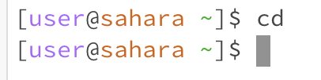
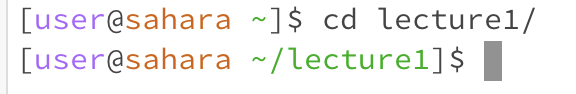
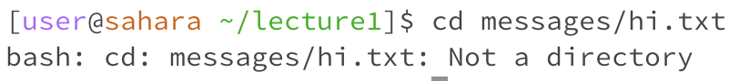
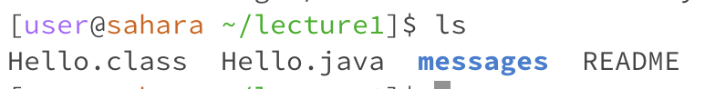

# Lab 1 Report

## cd Commands

1. Example of using the command with no arguments.
   
   * The working directory was the root directory
   * Nothing printed because the cd command is for changing the current directory so you need to provide a path
   * The output is not an error because the terminal did not break and it works fine after
3. Example of using the command with a path to a directory as an argument.
  
   * The working directory was the root directory
   * Nothing printed because the command does not give outputs and instead it changed the current directory to the directory I provided in the path
   * The output is not an error because the terminal did not break and it works fine after
4. Example of using the command with a path to a file as an argument.
  
   * The working directory was the lecture1 directory
   * There is no output as cd does not provide outputs but there is an error
   * There is an error stating that the provided path is not a directory and this is expected because cd expects a directory as an argument to switch into that directory

## ls Commands

1. Example of using the command with no arguments.
  
   * The working directory was the root directory
   * Nothing printed because the cd command is for changing the current directory so you need to provide a path
   * The output is not an error because the terminal did not break and it works fine after
2. Example of using the command with a path to a directory as an argument.
3. Example of using the command with a path to a file as an argument.

## cat Commands

1. Example of using the command with no arguments.
2. Example of using the command with a path to a directory as an argument.
3. Example of using the command with a path to a file as an argument.
