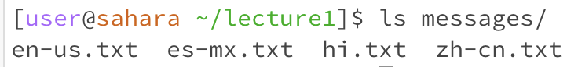
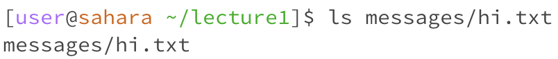
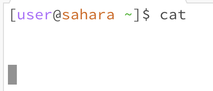
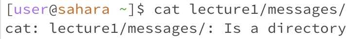
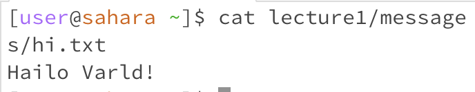

# Lab 1 Report

## cd Commands

1. Example of using the command with no arguments.
   
   * The working directory was the root directory
   * Nothing printed because the cd command is for changing the current directory so you need to provide a path
   * The output is not an error because the terminal did not break and it works fine after
3. Example of using the command with a path to a directory as an argument.
  
   * The working directory was the root directory
   * Nothing printed because the command does not give outputs and instead it changed the current directory to the directory I provided in the path
   * The output is not an error because the terminal did not break and it works fine after
4. Example of using the command with a path to a file as an argument.
  
   * The working directory was the lecture1 directory
   * There is no output as cd does not provide outputs but there is an error
   * There is an error stating that the provided path is not a directory and this is expected because cd expects a directory as an argument to switch into that directory

## ls Commands

1. Example of using the command with no arguments.
  
   * The working directory was the lecture1 directory
   * The file names of each file in the directory printed because the ls command lists every file in the current directory
   * The output is not an error
2. Example of using the command with a path to a directory as an argument.
   
   * The working directory was the lecture1 directory
   * The output printed the files in the messages directory because that is the directory path I provided as an argument for the command.
   * The output is not an error 
3. Example of using the command with a path to a file as an argument.
   
   * The working directory was the lecture1 directory
   * Only one file printed because the path is a file and there is only one file to list
   * The output is not an error 

## cat Commands

1. Example of using the command with no arguments.
   
   * The working directory was the root directory
   * Nothing printed because the cat command expects a file to print the contents of
   * The output is an error because after running cat without any arguments the terminal breaks and you cannot run any other commands.
2. Example of using the command with a path to a directory as an argument.
   
   * The working directory was lecture1/messages
   * The output states an error about the path not being a file because the cat command prints contents of files
   * The output is an error for the path being a directory
3. Example of using the command with a path to a file as an argument.
   
   * The working directory was lecture1/messages/hi.txt
   * Nothing printed because the cd command is for changing the current directory so you need to provide a path
   * The output is not an error because the terminal did not break and it works fine after
