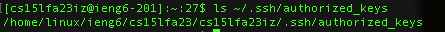

# Lab Report 2

## Part 1
### String Server Code
```
import java.io.IOException;
import java.net.URI;

class Handler implements URLHandler {
    // The one bit of state on the server: a number that will be manipulated by
    // various requests.
    int count = 0;
    String message = "";

    public String handleRequest(URI url) {
        if (url.getPath().equals("/")) {
            return String.format(message);
        } else {
            if (url.getPath().contains("/add-message")) {
                String[] parameters = url.getQuery().split("=");
                if (parameters[0].equals("s")) {
                    count += 1;
                    message += String.format("%d. %s\n", count, parameters[1]);
                    return String.format(message);
                }
            }
            return "404 Not Found!";
        } 
    }
}

class StringServer {
    public static void main(String[] args) throws IOException {
        if(args.length == 0){
            System.out.println("Missing port number! Try any number between 1024 to 49151");
            return;
        }

        int port = Integer.parseInt(args[0]);

        Server.start(port, new Handler());
    }
}
```

### Screenshots 

* Only the handle request method is called 
* The handle request method requests an argument for a url of type URI. `message` and `count` are relevant fields in the class. `message` has a value of `" "`, `count` has a value of `0`, and `uri` does not have a value because it just created.
* This specific request will increase `count` by 1 making it have a value of 1. `message` will add on the new message to the end of the string along with the count so it will have a value of `"1. Hello\n"`. `uri` is given the value of the new URL that needs to be handled. 


* Only the handle request method is called 
* The handle request method requests an argument for a url of type URI. `message` and `count` are relevant fields in the class. `message` has a value of `"1. Hello"`, `count` has a value of `1`, and `uri` does not have a value because it just created.
* This specific request will increase `count` by 1 making it have a value of 2. `message` will add on the new message to the end of the string along with the count so it will have a value of `"1. Hello\n 2. How are you\n"`. `uri` is given the value of the new URL that needs to be handled. 

## Part 2




## Part 3
I learned how websites handle string requests using a string handler. I understand now that the string handler takes in a url and parses it to handle the queries and depending on the values of the queries it changes the web page to correctly reflect the new path. 
