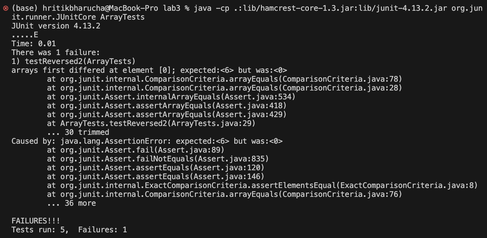

# Lab Report 3

## Part 1 - Bugs
* Failure-inducing input
  ```
  @Test
    public void testReversed2() {
      int[] input1 = {3,4,5,6};
      assertArrayEquals(new int[]{6,5,4,3}, ArrayExamples.reversed(input1));
    }
  ```
* Not a failure-inducing input
  ```
  @Test
  public void testReversed() {
    int[] input1 = { };
    assertArrayEquals(new int[]{ }, ArrayExamples.reversed(input1));
  }
  ```
* The symptom
  
* The bug
  - Before code:
     ```
     static int[] reversed(int[] arr) {
    int[] newArray = new int[arr.length];
    for(int i = 0; i < arr.length; i += 1) {
      arr[i] = newArray[arr.length - i - 1];
    }
    return arr;
    }
     ```
  - After code:
    ```
    static int[] reversed(int[] arr) {
    int[] newArray = new int[arr.length];
    for(int i = 0; i < arr.length; i += 1) {
      newArray[i] = arr[arr.length - i - 1];
    }
    return newArray;
    }
    ```
  The bug was that the function was returning the old array
  instead and setting values into that array from the new array,
  which will always be empty because we just initialized it
  and did not set any values to it. So, to fix this big we need to
  set the values of the new array by iterating backwards through the
  old array and then return that new array.

  ## Part 2 - Researching Commands
  ### Interesting grep command-line options
  1. -i option
      * Command: `grep -i "science" technical/plos/pmed.0020281.txt `
      * Output: `D.C., on May 15th, 2005, at the invitation and support of the Public Library of Science and`
      * The -i option performs a case-insensitive search on the file provided.
        This is useful because sometimes you want all instances of a word in a file whether or not it has variations in capitalization.
  2. -r option
     * Command: `grep -r "biotech" technical/biomed`
     * Output:
       ```
       technical/biomed/1472-6750-1-13.txt:        biology and biotechnology applications. Most recently, the
        technical/biomed/1471-2407-2-11.txt:        immunology and biotechnology, great progress has been made
        technical/biomed/1472-6750-2-21.txt:        a number of important biotechnology applications, including
        technical/biomed/1472-6793-1-6.txt:        biotechnology community. The advantages of the ECG
        technical/biomed/1471-2164-4-6.txt:        http://www.cstl.nist.gov/biotech/strbase. Non-integer
        technical/biomed/1471-2164-4-6.txt:        http://www.cstl.nist.gov/biotech/strbase/fbicore.htm.
       ```
     * The -r option performs a recursive search on every file in a given directory.
       This is useful because instead of manually inputting every file inside a directory
       you can search through the whole directory with one line.
  4. -n option
     * Command: `grep -n "biotech" technical/biomed/1472-6793-1-6.txt`
     * Output: `30:        biotechnology community. The advantages of the ECG`
     * The -n option provides the line numbers for each matching line in the given file.
       This is useful to quickly know exactly where the matching line in the file is.
  6. -A option
     * Command: `grep -A 2 "biotech" technical/biomed/1472-6793-1-6.txt`
     * Output:
       ```
       biotechnology community. The advantages of the ECG
        recording and analyses paradigm we developed are clear,
        given the high cost of breeding, housing, and transporting
       ```
     * The -A option provides lines after the matching line, which in this case
       is the 2 lines after the matching line. This is useful for getting more context
       about the matching line.
 
  ### Sources
  * ChatGPT
     - Input: `can you give me 4 interesting command-line options for using the grep command`
     - Output:
       ```
       Certainly! The `grep` command is a powerful tool for searching text patterns in files. Here are four interesting command-line options for using `grep`:

        1. `-i` option:
           The `-i` option makes `grep` perform a case-insensitive search. This means that it will match text patterns regardless of whether the letters are in uppercase or lowercase. For example:
           ```shell
           grep -i "example" file.txt
           ```
           This command will find and display all lines in "file.txt" that contain "example," regardless of the letter case.
        
        2. `-r` option (or `-R` for recursive):
           The `-r` option (or `-R`) allows `grep` to search for text patterns recursively in directories. This is useful for searching for patterns in multiple files within a directory and its subdirectories. For example:
           ```shell
           grep -r "pattern" /path/to/directory
           ```
           This command will search for "pattern" in all files under the specified directory.
        
        3. `-n` option:
           The `-n` option displays the line numbers for each matching line in the output. This can be helpful when you want to quickly locate where a particular pattern appears in a file. For example:
           ```shell
           grep -n "error" log.txt
           ```
           This command will show lines containing "error" along with their line numbers in the "log.txt" file.
        
        4. `-A`, `-B`, and `-C` options:
           These options allow you to display lines of context around each matching line. `-A` shows lines after the match, `-B` shows lines before the match, and `-C` shows lines both before and after the match. For example:
           ```shell
           grep -B 2 -A 2 "pattern" file.txt
           ```
           This command will display the two lines before and after each line containing "pattern" in "file.txt."
        
        These options provide flexibility and convenience when using the `grep` command to search for text patterns in files. You can combine them to customize your search to suit your specific needs.
       ```
    - Output changes:
       I used the output that chatGPT gave to understand what each option does so
      I just rewrote the definitions of each option in my own words. I also used
      the examples in the output as references for my own testing to understand the format.

     
  
