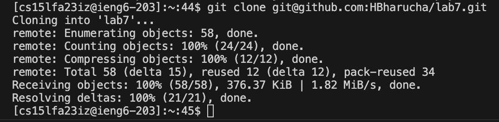

# Lab Report 4

## Step 4
 * Key Strokes:
      * `<up><enter>`
      * The ssh command to log in to ieng6 was one up in the search history so I used the up arrow to access it.
 * Result:
     

## Step 5
 * Key Strokes:
      * `<g><i><t><space><c><l><o><n><e><space><command><v><enter>`
      * I copied the ssh url to my clipboard and pasted it into the terminal
 * Result:
       

## Step 6
 * Key Strokes:
      * `<c><d><space><l><tab><enter><b><a><s><h><space><t><tab><enter>`
      * I changed the current directory to the lab7 directory using tab autocomplete after typing "l" and then I ran bash on test.sh with also using tab autocomplete after typing "t".
 * Result:
       

## Step 7
 * Key Strokes for `vim`:
      * `<v><i><m><space><L><tab><.><tab><enter>`
      * I opened the ListExamples.java file with vim and used tab autocomplete to fill in ListExamples after typing "L" and then autocompleted .java after typing ".".
 * Result for `vim`:
       
 * Key Strokes for editing:
      * `<4><3><j><e><x><i><2><esc><:><w><q><enter>`
      * I went down 43 lines to the line that needed to be changed then used "e" to go to the end of the first word which was index1 and then used "x" to delete the 1 and then went into insert mode and typed "2" and then saved and quit from `vim`.
 * Result for editing:
       

## Step 8
 * Key Strokes:
      * `<up><up><enter>`
      * The bash command was 2 up in the search history so I used the up arrow 
 * Result:
       

## Step 9
 * Key Strokes for `git add`:
      * `<g><i><t><space><a><d><d><space><L><tab><enter>`
      * I staged the ListExamples.java file and used tab autocomplete after typing "L".
 * Key Strokes for `git commit`:
      * `<g><i><t><space><c><o><m><m><i><t><space><-><m><space><"><T><e><s><t><s><space><f><i><x><e><d><"><enter>`
      * I committed the staged files with a commit message
 * Key Strokes for `git push`:
      * `<g><i><t><space>
<u><s><h><enter>`
      * I pushed the committed files to the repository
 * Result:
       
