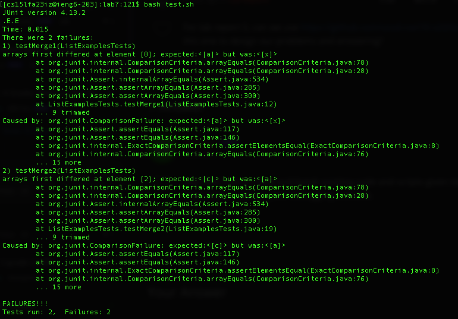

# Lab Report 5

## Part 1

Student: Hi, I can't figure out the problem with my code. Based off the errors from the test script, it looks like there are errors with the merge function and it is outputting incorrect elements for the merged array near the start of it. Here is a screenshot of said problem. 

TA: Hi, to take a closer look at what could be causing this problem, we can use jdb to next through the merge method by setting a breakpoint in the merge method and then print out the mergedList after each append to see what is being added to the new list. 

Student: Understood, I printed out the inputs list1 and list2 and the result after each element is added and I see that it keeps adding elements from list1. I think the problem is when adding to result using index2, it should be using list2.

TA: Great! Now implement your idea and see if the tests work correctly.

Student: Thank you! All the tests pass now.

### Setup Information:
1. Files Needed: In root directory, `test.sh`, `ListExamples.java`, and `ListExamplesTest.java` (files from lab7)
2. 
3. File Contents:
   * `test.sh`:
     
   * `ListExamples.java`
      
   * `ListExamplesTest.java`
     
     
4. Command line to trigger bug: `bash test.sh`

5. On line 33 change `result.add(list1[index2])` to `result.add(list2[index2])`

## Part 2

Something I learned from my lab experience in the second half of this quarter that I didn't know was 
that I could use JDB to debug my programs more effectively than simply using print statements
because JDB can provide much more information about what is happening at each line of the code.
